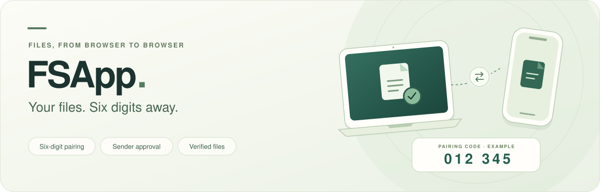
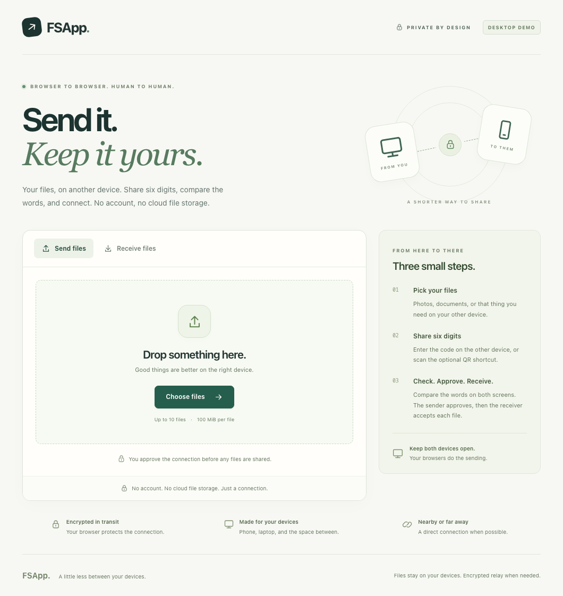
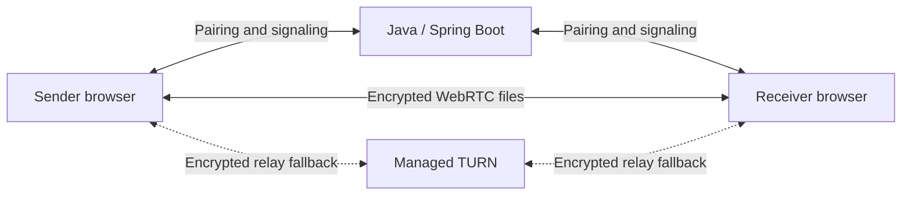

<p align="center">
  
</p>

<p align="center">
  Share files between browsers with a six-digit code.<br>
  Compare the words, approve the connection, and choose what to receive.
</p>

<h3 align="center">
  <a href="#get-started">Run FSApp locally ↓</a>
</h3>

<p align="center">
  No accounts · No cloud file storage · Web beta<br>
  Java 21 · Spring Boot · React / TypeScript · WebRTC
</p>

<p align="center">
  <a href="#features">Features</a> ·
  <a href="#get-started">Get started</a> ·
  <a href="#how-it-works">How it works</a> ·
  <a href="#development">Development</a> ·
  <a href="#project-status">Project status</a> ·
  <a href="#documentation">Documentation</a>
</p>

> **Web beta:** The local code → approve → transfer workflow is implemented. A public HTTPS demo, live TURN validation, and physical Android/iPhone testing remain release work. Both devices must stay open. See [project status](#project-status).

## Features

| Connect with six digits | Choose what to receive | Know what arrived |
| --- | --- | --- |
| Enter a single-use code or scan the optional QR shortcut. Compare the phrase on both devices before the sender approves. | Send up to **10 files**, **100 MiB each**, to one receiver. Each file requires separate acceptance. | Follow progress and verify received bytes with incremental SHA-256 before saving. |
| Unapproved rooms expire after ten minutes. Guessing limits and atomic admission protect the pairing flow. | Files transfer sequentially. Either device can cancel; received content is never opened automatically. | Stream to a selected file where supported, or download one verified Blob at a time. Receipt and download status are shown separately. |

FSApp uses Java to coordinate a connection between two browsers. File bytes travel over an encrypted WebRTC DataChannel, directly when possible or through a configured TURN relay. The application has no file-upload endpoint, account system, or cloud storage bucket.

<details>
<summary><strong>See the web interface</strong></summary>

<p align="center">
  
</p>

This is the implemented web application. The [demo guide](docs/DEMO.md) explains how to record a transfer and distinguishes desktop recordings from physical-phone testing.

</details>

## Get started

### 1. Prepare your environment

| Requirement | What you need |
| --- | --- |
| **Java** | JDK **21**, with `java` available in your shell. The backend has its own Maven Wrapper. |
| **Frontend tools** | **Node.js 24** and npm. Dependencies are pinned in the frontend lockfile. |
| **Browser** | A current browser with WebRTC and Web Crypto. Use two windows for a local trial. |
| **Network** | Internet access for initial dependency downloads. Phone access needs an HTTPS origin reachable by both devices. |

The native commands below use a POSIX shell. Docker is an alternative that supplies the build runtimes. The Android Gradle wrapper is unrelated to the web application.

### 2. Install and start FSApp

```sh
git clone https://github.com/SuryaSriramD/FSapp.git
cd FSapp

(cd web && npm ci)
./scripts/package.sh          # Build the UI, run Java tests, package one application
./scripts/run-server.sh
```

Open **[http://127.0.0.1:8080](http://127.0.0.1:8080)**. Spring Boot serves the UI, API, and WebSockets from the same origin. If you already have the repository, run the commands from `(cd web && npm ci)` onward.

Stop the server before rebuilding its running JAR. Native startup reads environment variables from your shell; it does not automatically load `.env`.

### 3. Send your first files

1. In the sender window, choose files and select **Create pairing code**.
2. Open the app in another window, choose **Receive files**, and enter the six digits. Leading zeroes matter; QR scanning is an optional shortcut.
3. Compare the four words on both screens. On the sender, choose **Approve connection** only when they match.
4. On the receiver, choose **Accept file**. Choose a save location if prompted; otherwise download the file after verification.
5. Choose **Next file** to continue, or **Finish transfer** after the last file.

Keep both browsers available throughout the transfer. `127.0.0.1` is local to each device: the address above cannot connect your phone to your computer. Use an HTTPS deployment for a two-device trial.

<details>
<summary><strong>Run with Docker</strong></summary>

From the repository root, with Docker running:

```sh
cp .env.example .env
./scripts/docker-build.sh fsapp:local
docker run --rm --name fsapp -p 127.0.0.1:8080:8080 --env-file .env fsapp:local
```

Open **[http://localhost:8080](http://localhost:8080)**, matching the origin in `.env.example`. Stop a native server using that port first. The build helper also handles AppleDouble metadata on external macOS drives.

This binds the app to the local computer. For public hosting, use the [deployment guide](docs/DEPLOYMENT.md) and [`render.yaml`](render.yaml). Run **one backend instance** and keep TURN master credentials in server environment variables.

</details>

<details>
<summary><strong>Building from an external macOS drive</strong></summary>

ExFAT volumes can create AppleDouble files that interfere with Java class discovery. Prefer an APFS checkout, or place Java build output on the native filesystem:

```sh
export FSAPP_BUILD_DIR=/tmp/fsapp-backend-build
./scripts/package.sh
./scripts/run-server.sh
```

Use the same `FSAPP_BUILD_DIR` for both scripts and when running the browser suite. The Docker build helper excludes these metadata files from its build context.

</details>

## How it works



| Layer | Responsibility |
| --- | --- |
| **Java 21 / Spring Boot 4** | Atomically redeem codes, authorize one sender and receiver, require sender approval, validate signaling, bound queues, expire rooms, and issue temporary TURN credentials. Uses Spring MVC and plain JSON WebSockets. |
| **React / TypeScript / Vite** | Present the pairing and consent flow, manage the browser session, and distinguish verified receipt from a requested download. Production assets are bundled into Spring Boot. |
| **WebRTC / browser file handling** | Transfer ordered chunks, bound outstanding data, hash incrementally, and save received files. File payloads remain outside the Java service. |
| **Cloudflare managed TURN** | Relay encrypted traffic when a direct route is unavailable. Server configuration is required; live provider validation is still pending. |
| **In-memory room state** | Keep bounded, expiring sessions in one Java process. No database, Redis, or message broker. |

The Java service is trusted for pairing and knows the strong authentication secret. **Six digits identify a pairing request; they are not an encryption key or proof of identity.** The browsers authenticate signaling with direction-specific HKDF/HMAC keys, and WebRTC supplies transport encryption. Hosting and relay providers still process connection metadata. See the [security model](docs/SECURITY.md).

A server restart invalidates pending rooms, but a working DataChannel can continue independently. A failed peer connection requires a fresh code and restarting the interrupted file. Completed downloads remain on the receiving device.

## Development

For UI development, run these commands in separate terminals:

```sh
# Terminal 1 — repository root: Java on port 8080
FSAPP_ALLOWED_ORIGINS=http://localhost:5173,http://127.0.0.1:5173 ./backend/mvnw -f backend/pom.xml spring-boot:run

# Terminal 2 — repository root: Vite on port 5173
cd web
npm run dev
```

Vite proxies HTTP and WebSocket requests to Java. The production application uses one origin instead.

### Run the checks

From the repository root:

```sh
(cd web && npm run typecheck && npm run lint && npm test)
./scripts/package.sh          # Production frontend build + Maven clean verify

cd web
npx playwright install chromium firefox webkit
npm run test:e2e
```

Stop any server already using port 8080 before this test run. Playwright starts the packaged application with test-specific request limits; reusing a normal local server can make the suite hit pairing limits. The suite includes real browser transfers, consent and approval barriers, cancellation, a ten-file batch with an exact 100 MiB file, and a backend restart during an established transfer.

[CI](.github/workflows/web.yml) is configured for Java tests, frontend checks, browser flows, a resolved Java dependency inventory, OSV scanning, and `npm audit`. Local results do not establish that a remote CI run has passed.

<details>
<summary><strong>Test configuration and relay checks</strong></summary>

| Setting | Purpose |
| --- | --- |
| `FSAPP_BASE_URL` | Test an already running service instead of starting the local packaged app. |
| `FSAPP_TEST_TURN=1` | Enable the gated managed-relay case after configuring actual provider credentials. |
| `FSAPP_SKIP_RESTART_TEST=1` | Skip the local Java process test when testing only a remote service. |
| `?relay=only` | Require relay for a manual connectivity test. |
| `?save=download` | Exercise the Blob fallback in a browser that otherwise offers a native save picker. |

The managed test server raises pairing attempt limits for repeated automation. For an existing `FSAPP_BASE_URL`, use a dedicated service with the [test settings](docs/DEPLOYMENT.md#automated-pairing-tests). Public defaults permit only **five code attempts per address per minute**; successful claims count too. Keep those defaults on the public demo.

</details>

## Project status

FSApp is a **working local web beta** for one sender and one receiver. Accounts, folders, automatic discovery, background delivery, and resumable transfers are outside this release's scope.

| Evidence | Recorded result |
| --- | --- |
| **Full local baseline · 14 September 2026 UTC** | 37 backend tests, 61 frontend tests, and 52 browser tests passed; 5 expected browser skips. TypeScript, lint, production build, and Docker checks passed. |
| **Local recheck · 26 September 2026** | Code pairing and byte-identical batch downloads passed in Chromium and desktop WebKit. Firefox's recheck was blocked by a test-browser profile launch error before the app opened. |
| **Still pending** | Public HTTPS deployment, live TURN and different-network validation, physical Android Chrome/iPhone Safari checks, and a two-minute physical-device demo. |

These are scoped results, not a claim of universal browser or network support. The [validation record](docs/VALIDATION.md) contains the full baseline, methodology, and release gates.

<details>
<summary><strong>Recorded local performance</strong></summary>

One run on **Apple M4 / 24 GiB RAM / Chromium 153**, with two browser contexts on the same host, a warm Java service, and Blob fallback:

| Measurement | Result |
| --- | --- |
| Create code → receiver consent, including automated sender approval | 495 ms |
| 100 MiB acceptance → verified receipt | 10.18 s |
| Downloaded bytes | Identical to the source |
| Sampled browser-process RSS peak during the 100 MiB transfer | 865.47 MiB |

This is a single desktop observation, not internet throughput or a phone memory bound. Browser-process RSS includes both contexts and shared pages may be counted more than once. Human approval time is not measured. See [raw measurements](docs/measurements/chromium-same-host.json) and the [measurement notes](docs/VALIDATION.md#measured-local-transfer).

</details>

The original Android prototype in [`app/`](app/) is experimental, excluded from the web build, and not a supported client. Its [limitations](docs/ANDROID_PROTOTYPE.md) are documented. A new native Android client follows the completed web release; see the [roadmap](FUTURE_SCOPE.md).

## Troubleshooting

| Symptom | What to check |
| --- | --- |
| The local page will not load | Start the server or Docker container and use its configured port. `/actuator/health` should report `UP`. |
| The code is invalid or already used | Ask the sender to create a new code. Codes are single use, and reloading does not restore a session. |
| Too many pairing attempts | Wait a minute. Requests behind the same proxy or network may share the guessing allowance. |
| The phone cannot open the app | A localhost URL points to the phone itself. Use an HTTPS origin reachable by both devices. |
| Pairing works but the peer connection fails | Check both networks and TURN configuration. Direct-only connectivity cannot cross every firewall or NAT. |
| Verification finished but the file is missing | Choose **Download file** and check browser downloads. “Download requested” does not confirm that the OS saved it. |

## Documentation

| Resource | Purpose |
| --- | --- |
| [Architecture](docs/ARCHITECTURE.md) | Java coordination, browser transport, relay, and process boundaries. |
| [Protocol](docs/PROTOCOL.md) | Pairing endpoints, authenticated signaling, frames, and transfer state. |
| [Security model](docs/SECURITY.md) | Trusted pairing, code guessing, metadata, and protection limits. |
| [Deployment](docs/DEPLOYMENT.md) | Docker, Render, HTTPS, cold starts, TURN controls, and test settings. |
| [Validation record](docs/VALIDATION.md) | Executed checks, measured results, and remaining release gates. |
| [Demo guide](docs/DEMO.md) | Reproducible recordings and the physical-device storyboard. |
| [Failure write-up](docs/FAILURE_WRITEUP.md) | A WebSocket routing failure and the integration tests that caught it. |
| [Configuration template](.env.example) | Server origins, resource limits, and relay credentials. |

## More projects

- **[DroidDock](https://github.com/SuryaSriramD/DroidDock)** — Android virtual devices in a native macOS window.
- **[CrawlCite](https://github.com/SuryaSriramD/Intelligent-Q-A-System)** — Website conversations with local AI and inspectable citations.
