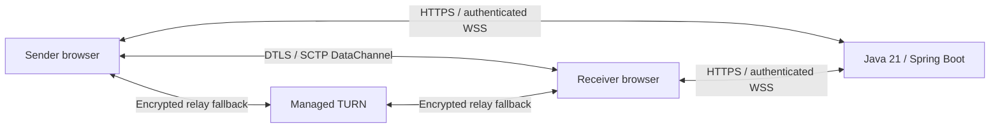

# Architecture

FSApp coordinates live one-to-one file transfers. The Java process serves the
React application, redeems single-use six-digit codes, enforces sender approval,
and forwards WebRTC negotiation messages. File manifests and
file bytes travel over an authenticated WebRTC DataChannel, directly where ICE
can establish a route and through managed TURN otherwise.

## Boundaries

- **Java:** trusted code redemption, strong pairing-secret generation, sender
  approval, room admission, participant tokens, concurrency, expiry, message
  limits, rate limits, provider credential issuance, and health checks.
- **Browser:** matching confirmation phrases, authenticated signaling, WebRTC,
  file consent, chunking, incremental hashing, backpressure, and saving.
- **TURN:** forwards encrypted packets. It does not provide a downloadable file
  mailbox. Providers still observe network metadata.

The sender compares a four-word phrase with the intended receiver and approves
before Java permits ICE issuance or signaling. The receiver sees no manifest
until that approval, and must then accept each file before payload is sent. A receive window and
WebRTC's local buffered-byte limit protect slow consumers. Sequential file
handling prevents the ten-file batch from accumulating in receiver memory.

## One process by design

There is no database. Room state is bounded and expires from RAM. Run exactly
one Java instance; independent replicas cannot coordinate a room. A restart
invalidates tokens and pending rooms. An open DataChannel can keep working
without signaling until transport fails or credentials need renewal. Failed
connections require a new code; there is no automatic resume or room
recreation.

The existing `app/` Gradle module is an experimental Android prototype. It is
independent of the Maven server and is not part of the web build or CI gate.
Native interoperability is a future client of the documented wire protocol.

## Why these choices

Spring MVC and ordinary WebSocket handlers make admission races, authorization,
resource bounds, and process lifecycle explicit and testable. The UI and backend
share one origin and one Docker deployment. WebRTC handles transport encryption
and connectivity instead of proxying every file through the Java service.

Persistent accounts, databases, Redis, brokers, resumability, and background
transfer services are intentionally outside this portfolio release.

## References

- [WebRTC peer connections](https://webrtc.org/getting-started/peer-connections)
- [WebRTC security architecture, RFC 8827](https://www.rfc-editor.org/rfc/rfc8827.html)
- [Spring WebSocket API](https://docs.spring.io/spring-framework/reference/web/websocket/server.html)
- [Cloudflare TURN](https://developers.cloudflare.com/realtime/turn/)
