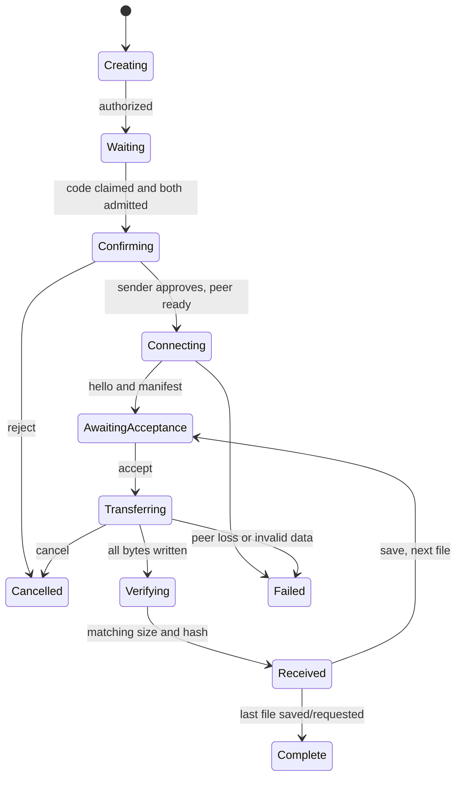

# FSApp protocol v1

The browser protocol is defined in `web/src/lib/`; backend envelopes are validated
in `backend/src/main/java/dev/fsapp/backend/SignalEnvelope.java`. The exact HMAC
fixture is in `web/src/lib/crypto.test.ts`. Change the version for incompatible
encodings. Neither the service nor TURN receives plaintext filenames/manifests.

## Connection service

All HTTP endpoints use JSON responses and `Cache-Control: no-store`. Participant
tokens and pairing secrets are opaque, random 32-byte values, encoded as unpadded
base64url. The trusted Java service generates and distributes the pairing secret.
Only code redemption accepts a request body, an `application/json` object with
`code`, capped at 128 bytes (including chunked requests).

| Interface | Request | Response |
| --- | --- | --- |
| `POST /v1/sessions` | No body | 201: `id`, `senderToken`, `code`, `key`, `attempt`, ISO `expiresAt`, `maxFileBytes:104857600`, `maxFiles:10` |
| `POST /v1/pairings` | `{code:"012345"}` | 200: `id`, receiver `token`, `key`, `attempt`, ISO `expiresAt`; consumes the code atomically |
| `WS /v1/sessions/{id}` | First text message: `{type:"auth",role:"sender"|"receiver",token}` | `{type:"ready",role}`, then `{type:"pairing-pending"}` when both admitted |
| `POST /v1/sessions/{id}/approve` | Sender bearer token; both participants must be admitted | 204; sends `{type:"peer-ready"}` once to both peers |
| `POST /v1/sessions/{id}/ice` | Participant bearer token after authenticated WebSocket join and sender approval | `iceServers`, `relayEnabled`, optional/null ISO `expiresAt` |
| `DELETE /v1/sessions/{id}` | Sender or claimed receiver bearer token | 204; closes signaling and invalidates the room, even before WebSocket join |

REST errors have `code` and `message`. WebSocket errors add `type:"error"`.
A role cannot join twice. The first successful admission wins competing joins.
Malformed messages, role violations, duplicate negotiation, and rate violations
close the offending socket. The service forwards only validated signaling
frames. Browsers verify HMAC; the server knows the secret but does not use it to
verify forwarded envelopes. It binds them to the generated connection-attempt ID.
ICE and signaling before sender approval fail with `approval_required` (409).
Invalid, expired, or already consumed codes return the same `pairing_unavailable`
error (404). Code lookup is rate limited before parsing or searching room state.
Both participants may cancel a room; only the sender may approve a connection.
Receiver cancellation/disposal also deletes a redeemed room before WebSocket
authentication, so cancelling an in-flight lookup does not leave the sender waiting
on an already consumed code. A lost lookup response cannot be recovered; create
a fresh code. Expiry remains the fallback for unreachable clients or lost cleanup.

Clients send `{type:"ping"}` every 25 seconds; the server replies `{type:"pong"}`.
Heartbeats do not extend room expiry. Unpaired rooms expire after ten minutes;
approved rooms expire two hours after sender approval. Claiming a code or joining
does not extend the original ten-minute approval window. A
participant leaving removes the room and signals `{type:"peer-left"}` to its peer.
A restart loses every room. None of these events cancels a working DataChannel.

Both browsers wait for `peer-ready` before requesting ICE configuration, so issued
TURN credentials can cover the live room lifetime. Credentials are cached per
participant, bounded, and temporary. A failed provider request yields STUN-only
configuration. `?relay=only` refuses that fallback for explicit relay validation.
Re-pair if a connection fails; v1 does not renew through ICE restarts or resume.

## Pairing and signed signaling

A server creates a 32-byte secret and a 16-byte connection-attempt ID using
Java `SecureRandom`. A uniformly random, zero-padded six-digit code identifies
one unused room. Active code collisions are retried under the room lock. Manual
entry preserves leading zeroes. The optional QR shortcut is:

```text
/#code=012345
```

The fragment never enters an HTTP request URL. The recipient parses it and
immediately replaces its current history entry without the fragment, then submits
the code to `/v1/pairings` in JSON. Pairing values are not persisted in local
storage. Reload requires a fresh code; a participant slot cannot be reclaimed.
No legacy secret-bearing invitation links are accepted by the new pairing UI.

Both devices show a deterministic four-word phrase bound to the room, attempt,
and strong secret. Compare it before the sender approves. Approval gates peer
negotiation; the receiver's later per-file acceptance gates payload. The service
is trusted for pairing, and knows enough to forge signaling if compromised.

Phrase input is UTF-8 of the exact compact JSON array
`JSON.stringify(["fsapp.v1.confirmation",roomId,attemptBase64url,keyBase64url])`.
Hash with SHA-256. Treat its first three bytes as an unsigned big-endian integer;
extract six-bit indices at shifts 18, 12, 6, and 0 into the fixed 64-word
`CONFIRMATION_WORDS` table in `crypto.ts`, then join with single spaces. The
comparison phrase has 24 bits; it is not a replacement for the 256-bit key.
The phrase fixture is tested alongside the signed-envelope fixture.

Signed envelopes are:

```text
{type:"signal",version:1,roomId,attemptId,role,seq,kind,payload,mac}
```

`kind` is `offer`, `answer`, or `ice`. `payload` is base64url of UTF-8 JSON.
`seq` starts at 1 independently in each direction. The receiver accepts only the
next sequence, the expected opposite role, its room, and its attempt ID.

Derive one key per sending role with HKDF-SHA-256:

```text
IKM  = decoded 32-byte server-generated pairing secret
salt = UTF8("fsapp.v1.signaling")
info = UTF8(JSON.stringify([1,roomId,attemptId,role]))
L    = 32 bytes
```

HMAC-SHA-256 input is exactly the following compact JSON array, encoded as UTF-8:

```text
JSON.stringify([1,roomId,attemptId,role,seq,kind,payload])
```

Encode the 32-byte MAC as unpadded base64url. The payload string is signed as sent,
so no canonicalization of its internal JSON object is necessary. Reject malformed
or noncanonical base64url. Verify before decoding/applying SDP or ICE candidates.
The DTLS certificate fingerprint in SDP is covered by this authentication.

Only the sender offers. The receiver answers once. Local candidates queue until
the local description is sent; remote candidates queue until remote description
application. Both candidate counts and incoming/outgoing signaling queues are
bounded. The server caps text messages at 64 KiB; the client caps decoded payloads
at 32 KiB.

## DataChannel

Use label `fsapp-v1`, ordered and reliable delivery, with no partial reliability
settings. Every frame is at most 16,384 bytes. Control frames are UTF-8 JSON text;
file chunks are binary. Protocol violations stop the transfer and abort partial
file writes. Do not display or execute received content.

| Control | Fields in addition to `type` | Meaning |
| --- | --- | --- |
| `hello` | `version:1,maxFiles:10,maxFileBytes:104857600,maxFrameBytes:16384` | Compatible capabilities required before manifest |
| `manifest` | `files:[{id,name,size,mime}]` | Sender describes 1–10 files with IDs 0…n−1 |
| `accept` | `fileId` | Receiver has explicitly approved and prepared a sink |
| `ack` | `fileId,offset` | Next expected byte, only after writing the chunk |
| `end` | `fileId,size,hash` | Sender finished; hash is lowercase SHA-256 hex |
| `receipt` | `fileId,size,hash,saveStatus:"verified"|"saved"` | Receiver matched length/hash and finished its sink |
| `cancel` | `message` | Participant cancels |
| `error` | `message` | Terminal protocol or transfer failure |

Rejecting the offered batch uses `cancel`; no file bytes precede `accept`.
The receiver sanitizes filenames, caps name/MIME lengths, validates all sizes,
and addresses files by ID rather than name. Duplicate names remain distinct IDs.

### Binary frame (network byte order)

| Offset | Bytes | Value |
| --- | --- | --- |
| 0 | 2 | Magic `0x4653` |
| 2 | 1 | Version `1` |
| 3 | 1 | Reserved `0` |
| 4 | 4 | File ID, unsigned |
| 8 | 4 | Byte offset, unsigned |
| 12 | 4 | Payload length, unsigned |
| 16 | 1–16,368 | File bytes |

Offsets must be contiguous and correspond to the accepted file. Bytes cannot
exceed its declared size. Empty files send no chunk frames and still require
consent and verification of SHA-256 of the empty byte string.

### Backpressure and completion

The sender reads one slice at a time, updates an incremental SHA-256 digest,
and permits at most 256 KiB unacknowledged payload and approximately 128 KiB
of queued DataChannel data (plus one frame at a threshold boundary). The receiver
serializes sink writes and only then acknowledges. Its message queue also has
count and byte bounds. A 45-second no-progress timer ends a stalled active file;
waiting for user consent or advancing to the next file has no transfer timer.

The receiver updates its own incremental digest and compares both exact byte
length and hash before sending `receipt`. A selected-file sink closes only after
verification. A fallback sink makes an inert `application/octet-stream` Blob URL.
The UI separately labels **received and verified**, **download requested**, and
**saved and verified**. A browser download click cannot prove the OS saved a file.

For Blob fallback, only one file is staged. The receiver requests its download
and advances explicitly; advancing revokes the previous URL and clears memory
before the next acceptance. Cancellation/failed connections abort partial sinks.
A completed staged Blob remains downloadable after a peer failure until the user
resets/disposes that session. Already downloaded files stay on the device.

## State and failure boundary



Signaling loss is tracked separately from file state. An open peer transport can
finish even when room state disappears. A failed peer transport ends the active
file. A new code starts a new attempt; v1 does not retain or resume partial
file offsets across attempts.
